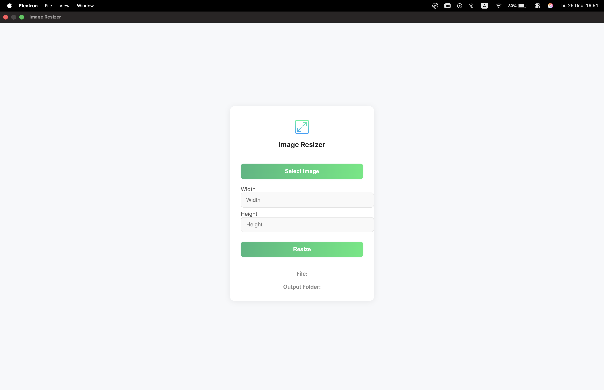

# 🖼️ Image Resizer (Electron)

A simple **Electron desktop application** that allows you to select an image and easily resize it by changing the **width and/or height**.

> 🎓 **Learning Project**: This project was built **for learning and practice purposes**, mainly to explore Electron fundamentals and desktop app structure.

<div style="display: flex; justify-content: center">
  
</div>

---

## ✨ Features

* Select images directly from your local machine
* Resize images by width and/or height
* Simple and clean user interface
* Cross-platform (Windows, macOS, Linux)
* Developer tools enabled automatically in development mode

---

## 🚀 Getting Started

### Prerequisites

* **Node.js** (LTS recommended)
* **npm** (comes with Node.js)

### Install Dependencies

```bash
npm install
```

### Run the Application

```bash
npm start
```

### Development Mode (Hot Reload)

To automatically reload the app when making changes, you can use **Electronmon**:

```bash
npx electronmon .
```

This is especially useful during development to speed up iteration.

---

## 📦 Packaging

There are multiple ways to package Electron applications. A recommended tool is **Electron Forge**, which simplifies building, packaging, and distributing apps.

🔗 [https://www.electronforge.io/](https://www.electronforge.io/)

> ⚠️ Note: Packaging is **not implemented** in this project, as the focus is on learning Electron basics rather than distribution.

---

## 🛠️ Developer Mode

The application behavior changes depending on the `NODE_ENV` value:

* **development**

  * DevTools are enabled
  * DevTools open automatically
  * DevTools are available in the menu bar

* **production**

  * DevTools are disabled
  * Cleaner and more secure UI

---

## 📚 Learning Goals

This project was created to practice and understand:

* Electron app structure
* Main vs Renderer process
* IPC communication basics
* Desktop UI development using web technologies

---

## 📄 License

This project is open-source and intended for **educational use**. Feel free to explore, modify, and learn from it.

---

Happy coding! 🚀
